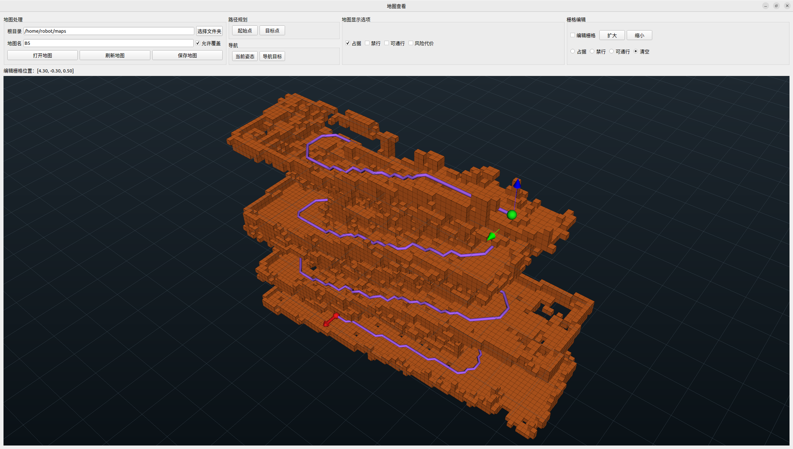
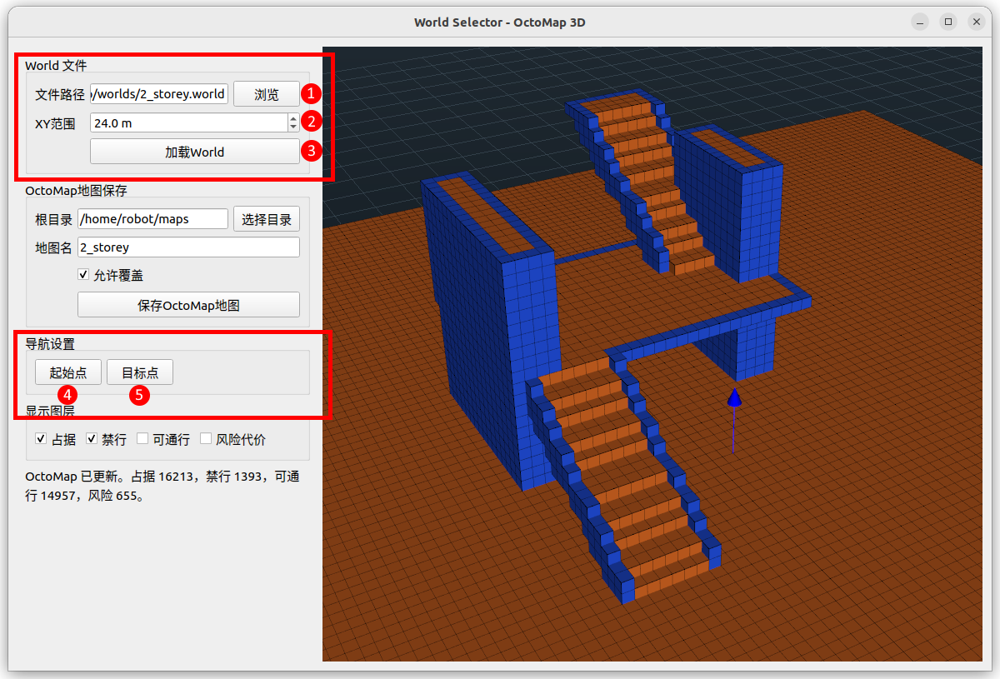
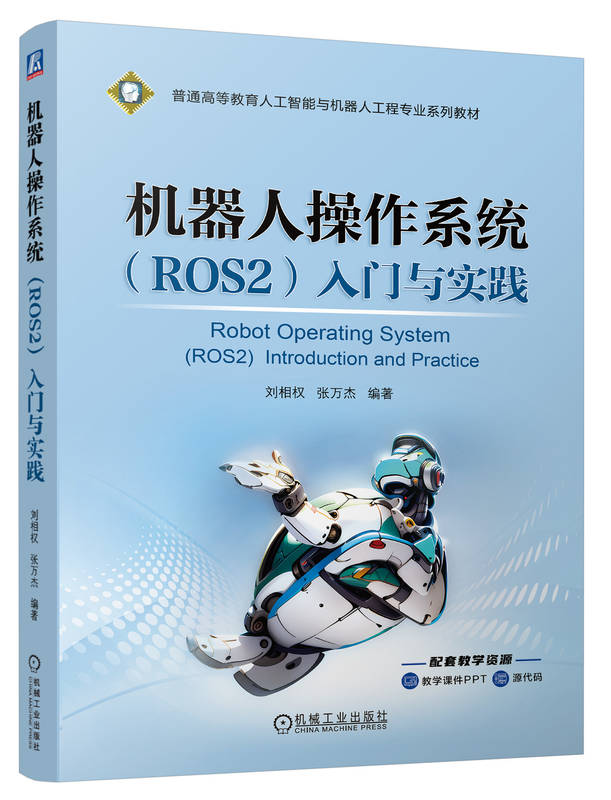

# jie_3d_nav

[English](./README.en.md)

一套基于 ROS 2 Humble 的 3D 导航系统，通过 Web 界面交互。本系统已在智元科技 D1 机器狗以及留形科技 Odin 1 空间定位模组上测试通过。

<p align="center">
  
</p>

本目录包含三个 ROS 2 包：

- `jie_map_msgs`：地图包保存、加载、导出等自定义服务接口。
- `jie_octomap`：OctoMap 管理包，负责多种地图格式导入、地图包保存/加载、OctoMap 可视化和编辑。
- `octo_planner`：基于 OctoMap 的 3D 路径规划、路径跟踪控制和 Web 测试/导航 launch。

## 功能概览

- 将 PCD 点云地图导入为 OctoMap。
- 将 ROS 2D 栅格地图导入为 3D OctoMap。
- 将 Gazebo `.world` / `.sdf` 场景转换为 OctoMap。
- 保存、加载 OctoMap 地图包。
- 使用 Qt/VTK GUI 查看和编辑 OctoMap 栅格。
- 使用 Web 页面查看 OctoMap、选择起点/终点并进行路径规划。
- 提供面向安装了留形科技 Odin 1 的 智元 D1 机器狗的导航入口和独立网页测试入口。

## 介绍视频

- Bilibili：[【开源】基于ROS2的3D导航系统](https://www.bilibili.com/video/BV1jgR9BmELw)
- YouTube：[【开源】基于ROS2的3D导航系统](https://www.youtube.com/watch?v=CepO90mzIeI)

## 目录结构

```text
jie_3d_nav/
├── jie_map_msgs/        # 自定义 srv 接口
├── jie_octomap/         # OctoMap 导入、管理、编辑、Web/GUI 工具
├── octo_planner/        # 3D 路径规划、控制器、导航 launch
├── worlds/              # 示例 Gazebo world
└── install_deps_humble.sh
```

## 环境要求

- Ubuntu 22.04
- ROS 2 Humble
- `colcon`
- OctoMap / octomap_msgs
- OpenCV
- Open3D C++ 开发库
- PyQt5、VTK、NumPy、Pillow、PyYAML
- 可选：`rosbridge_server`，用于 Web 页面通过 websocket 访问 ROS

基础编译不需要以下两个包：

- `d1_bringup`
- `d1_description`

注意：完整智元科技 D1 机器狗导航入口 `octo_planner/launch/nav.launch.py` 仍然会在运行时使用 `d1_bringup` 和 `d1_description`，因为它会启动 `d1_core` 并读取智元科技 D1 机器狗的 URDF。

## 安装依赖

可以使用仓库内脚本安装常用依赖：

```bash
cd ~/ros2_ws/src/jie_3d_nav
bash install_deps_humble.sh
```

如果 CMake 找不到 Open3D，需要额外安装 Open3D C++ 开发库，并确保 `Open3DConfig.cmake` 能被 CMake 找到，例如通过 `Open3D_DIR` 或 `CMAKE_PREFIX_PATH` 指定。

## 编译

从 ROS 2 工作区根目录编译：

```bash
cd ~/ros2_ws
source /opt/ros/humble/setup.bash
colcon build --packages-select jie_map_msgs jie_octomap octo_planner
source install/setup.bash
```

如果源码目录移动过，旧 CMake 缓存可能还指向旧路径，可以清理缓存后重编：

```bash
colcon build --packages-select jie_map_msgs jie_octomap octo_planner --cmake-clean-cache
```

## 快速体验

运行如下指令加载例子地图：

```bash
ros2 launch jie_octomap import_gazebo_world.launch.py world_name:=2_storey.world
```

在弹出的窗口中，加载gazebo的world文件，设置地图的截取边长，点击加载按钮即可将world文件转换成OctoMap，并显示在窗口中。

<p align="center">
  
</p>

先点击“起始点”按钮，用鼠标在地图上设置起始点位置。再点击“目标点”按钮，用鼠标在地图上设置目标点位置，即可规划出可行的路径。

<p align="center">
  
</p>

## 地图导入

### 导入 PCD 点云地图

```bash
ros2 launch jie_octomap import_pcd_map.launch.py
```

该 launch 会启动：

- `pcd_to_octomap_node`
- `octomap_to_occupied_markers_node`
- `map_package_manager`
- `pcd_map_import_gui`
- `octo_planner/jie_path_node`

### 导入 ROS 2D 栅格地图

```bash
ros2 launch jie_octomap import_ros_map.launch.py
```

该 launch 会启动：

- `occupancy_grid_to_octomap_node`
- `octomap_to_occupied_markers_node`
- `map_package_manager`
- `ros_map_import_gui`
- `octo_planner/jie_path_node`

### 导入 Gazebo World / SDF

加载包内示例 world 时，推荐使用 `world_name`：

```bash
ros2 launch jie_octomap import_gazebo_world.launch.py world_name:=field.world
```

加载外部 world 文件时，继续使用绝对路径：

```bash
ros2 launch jie_octomap import_gazebo_world.launch.py world_file:=/absolute/path/to/map.world
```

如果同时传入 `world_file` 和 `world_name`，优先使用 `world_file`。

`jie_octomap/worlds/` 目录内提供了两个示例 world 文件，并会随 `jie_octomap` 包安装到 `share/jie_octomap/worlds/`：

- `2_storey.world`：双层建筑/楼层示例。
- `field.world`：场地示例。

加载双层建筑示例：

```bash
ros2 launch jie_octomap import_gazebo_world.launch.py world_name:=2_storey.world
```

加载场地示例：

```bash
ros2 launch jie_octomap import_gazebo_world.launch.py world_name:=field.world
```

该 launch 会启动：

- `world_to_octomap_node`
- `world_selector_gui.py`
- `map_package_manager`
- `octo_planner/jie_path_node`

## 地图管理与编辑

OctoMap 管理和编辑主入口：

```bash
ros2 launch jie_octomap map_manager.launch.py
```

该 launch 会启动：

- `map_package_manager`
- `octomap_to_occupied_markers_node`
- `map_viewer_gui`
- 可选 `octo_planner/jie_path_node`

`map_viewer_gui` 支持：

- 打开地图包
- 刷新地图
- 保存地图
- 查看占据、禁行、可通行、风险代价图层
- 编辑栅格：`occupied`、`preblocked`、`traversable`、`clear`
- 选择起点、终点、导航目标

## Web 可视化

### 加载地图并启动 Web 页面

```bash
ros2 launch jie_octomap web_octomap.launch.py map_package:=~/maps/map
```

常用参数：

- `map_package`：已保存的地图包目录。
- `http_port`：静态 Web 服务端口，默认 `8080`。
- `launch_rosbridge`：是否启动 `rosbridge_websocket`。
- `launch_map_gui`：是否同时启动 Qt 保存/加载窗口。

浏览器访问：

```text
http://<机器人IP>:8080
```

### Web 功能测试

```bash
ros2 launch octo_planner web_test.launch.py
```

`web_test.launch.py` 用于测试网页访问、地图显示、Web 起终点选择、路径规划和基础控制链路。该 launch 已去除对 `d1_bringup` 和 `d1_description` 的依赖，会使用一个最小 `base_link` URDF 启动 `robot_state_publisher`。

启动前同样需要根据实际环境配置：

```text
octo_planner/config/nav_params.yaml
```

至少需要部署好：

- `relocalization_bin_file`：重定位使用的 `.bin` 地图文件。
- `map_package_dir`：已经保存好的 OctoMap 地图包目录。

## 智元科技 D1 机器狗完整导航

完整机器人导航入口：

```bash
ros2 launch octo_planner nav.launch.py
```

该 launch 面向智元科技 D1 机器狗实际导航，并结合留形科技 Odin 1 空间定位模组相关驱动流程，会启动或使用：

- `d1_bringup/d1_core`
- `d1_description/urdf/d1.urdf`
- `odin_ros_driver`
- `octo_planner/jie_path_node`
- `octo_planner/d1_controller`
- `jie_octomap/map_package_manager`
- Web viewer 和 `rosbridge_websocket`

运行前需要根据实际环境修改：

```text
octo_planner/config/nav_params.yaml
```

重点字段：

- `relocalization_bin_file`
- `map_package_dir`
- `relocalization_pcd_file`
- `show_rviz`
- `show_map_gui`
- `publish_d1_odom`
- `use_static_odom_to_base`

同时需要确认留形科技 Odin 1 空间定位模组驱动配置：

```text
odin_ros_driver/config/control_command.yaml
```

将其中的 `custom_map_mode` 设置为 `2`，即 `Relocalization mode`。

`octo_planner/config/nav_params.yaml` 中至少需要部署好：

- `relocalization_bin_file`：重定位使用的 `.bin` 地图文件。
- `map_package_dir`：已经保存好的 OctoMap 地图包目录。

如果需要使用 RViz 观察定位效果，还需要部署：

- `relocalization_pcd_file`：用于 RViz 显示的 `.pcd` 点云地图文件。

## 其他 Launch

```bash
ros2 launch jie_octomap octomap_test.launch.py
ros2 launch jie_octomap octomap_open3d.launch.py
ros2 launch jie_octomap odin1_slam.launch.py
ros2 launch jie_octomap odin1_loc.launch.py
```

其中 `odin1_slam.launch.py` 和 `odin1_loc.launch.py` 面向留形科技 Odin 1 空间定位模组流程，运行时需要 `odin_ros_driver`，并可选使用 `odin_costmap` 配置。

## 入门教材推荐

《机器人操作系统（ROS2）入门与实践》

<p align="center">
  
</p>

淘宝链接：[《机器人操作系统（ROS2）入门与实践》](https://world.taobao.com/item/820988259242.htm)
